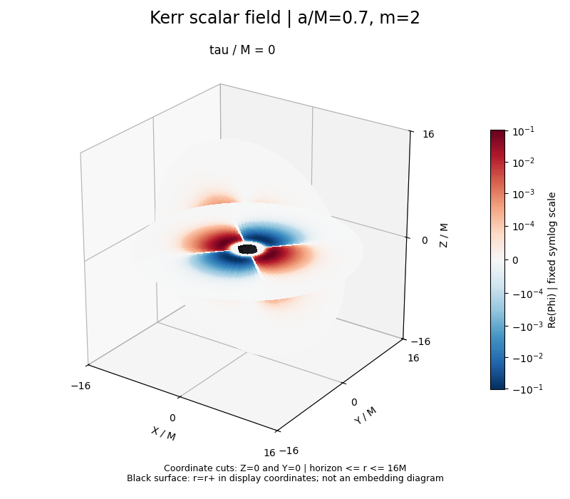

# Kerr 双曲切片演化：s=-2 与 s=0 参考

现已导入与 [IndigoJX 参考仓库](https://github.com/IndigoJX/ParticleSourceEvolutionInHyperboloidalCompactCoord/tree/13fc2b485f76b1284c2e17879ede9075de062a9d) 固定提交一致的 **s=-2 点粒子 Teukolsky 演化器**：轨迹、四块源项、七点空间离散、RK4、零无穷波形提取与 checkpoint/restart。导入文件保持原样，见 [对齐说明](docs/upstream_alignment.md) 和 [逐文件校验清单](docs/upstream_manifest.json)。

```bash
python3 -m venv .venv
.venv/bin/python -m pip install -r requirements-aligned.txt
bash run_sminus2.sh --run-id kerr-sminus2-smoke --no-progress
```

默认运行 a/M=0.8、m=2、质量比 1e-5 的上游 smoke 配置。结果写入 `data/kerr_point_particle_evolution/runs/`；波形是零无穷处的复 psi4_22。默认不计算应变 h。上游 A1 符号/归一化 bridge 的 `conditional-open` 状态保留。

s=0 参考来自上游通用自旋算符的标量极限，已核对 24 组参数的全部系数。原标量实现、图和 PDF 保留如下，其 sigma/tau 坐标可用 `src/scalar_upstream.py` 转成 R/T/psi0。旧 PDF 不作为 s=-2 推导；后者以 [上游推导](findings/kerr_point_particle_evolution/theory/DERIVATION.md) 为准。

## 原有 s=0 标量演化

[中文推导 PDF（8 页）](docs/kerr_hyperboloidal_derivation_zh.pdf)：从 Kerr 标量波动方程、坐标变换、场重标度到球谐投影、特征边界和数值演化的完整步骤。

独立 WSL 项目：`/home/ljq/code/kerr-hyperboloidal`。分支：`Kerr双曲切片演化`。

在固定 Kerr 背景上求解无质量、无源、最小耦合标量场 `Box_g Phi = 0`。
采用 horizon-penetrating hyperboloidal minimal gauge，将未来零无穷置于 `sigma=0`，未来事件视界置于 `sigma=1`。
实际演化正则场 `u=r Phi` 和 `p=partial_tau u`，包含两个端点，无人工反射边界条件。

框架入口为用户 Zotero 收藏夹“双曲框架”中的 Macedo–Zenginoglu (2025)
《Hyperboloidal Approach to Quasinormal Modes》。Kerr 系数直接核对该收藏夹中
Ripley (2022) 的式 (11)，取场自旋权重 `s=0`；这里不是将 Schwarzschild 势简单替换成 Kerr 势。
角向采用固定 `m` 的球谐 Galerkin 展开，完整保留截断空间内的 `l ↔ l±2` 耦合及所有 `im a` 项。

## 结果预览

`a/M=0.7, m=2` 的标量场三维切面演化（`0–80M`）：



[六个时刻的高清快照](docs/figures/snapshots_3d.png) ·
[视界与零无穷的模态波形](docs/figures/waveforms.png) ·
[收敛数据](docs/convergence.json)

这些示例图随 Git 保存；完整可再生演化数组仍写入忽略的 `outputs/`。

## 运行

```bash
cd /home/ljq/code/kerr-hyperboloidal
bash run.sh --spin 0.7 --m 2 --initial-l 2 --lmax 6 --n 64 --tmax 80 --output outputs/my_kerr
```

`--spin` 是 `a/M`，`--mass` 是 `M`，`--tmax` 是有量纲几何时间 `tau`（默认 `M=1`）。
`--n 64` 表示 65 个 Chebyshev–Lobatto 径向点；`--lmax` 必须通过收敛检查选取。
初始场是 `sigma` 上两端为零的 Gaussian 型 `l=initial_l` 脉冲，初始 `p=0`；
因此它通常含向内及向外传播两部分，不能称为纯出射脉冲。

输出包括 `evolution.npz`（时间、网格、所有球谐系数及其时间导数）、
`waveforms.csv`（两个端点各模态实部与虚部）、`waveforms.png` 和 `run.json`。
视界处的物理场是 `u/r_plus`；零无穷处记录的是辐射场 `lim r Phi`。
一个复 `m` 扇区的实部可以构造实标量场；任意三维数据可线性叠加多个 `m` 扇区。

## 验证与重现示例

```bash
OPENBLAS_NUM_THREADS=1 .venv/bin/python -m unittest discover -s tests -v
OPENBLAS_NUM_THREADS=1 .venv/bin/python src/validate.py
```

验证覆盖 Ripley 方程系数、球谐投影、端点因果方向、Schwarzschild 解耦、
Kerr 模态耦合、`m ↔ -m` 共轭关系及质量缩放。
收敛脚本比较径向 `N=32,48,64`、角向 `lmax=4,6,8` 和时间容差，并生成 `m=0,2` 两组 Kerr 示例。
定量结果见 [验证记录](docs/validation.md)。

## 环境

项目使用独立 `.venv`，不共享或修改其他项目的第三方包。重建：

```bash
/home/ljq/miniconda3/envs/few_env/bin/python -m venv .venv
.venv/bin/python -m pip install -r requirements-lock.txt
```

源文献不需要随运行加载。依赖已锁定，运行不需要 Zotero 或网络。
详细推导见 [Kerr 方程说明](docs/kerr_hyperboloidal_zh.md)，文献阅读范围见
[Zotero 来源记录](docs/zotero_sources.md)。

## 三维演化可视化

```bash
OPENBLAS_NUM_THREADS=1 .venv/bin/python src/plot_3d.py
```

读取已有 `outputs/kerr_m2/evolution.npz`，输出到 `outputs/kerr_m2/three_d/`：
`snapshots_3d.png`（6 个时刻）和 `evolution_3d.gif`（0–80M、81 帧）。
图示为重建的 `Re(Phi)=Re(sum_l u_lm Y_lm)/r`，取单个复 `m=2` 解的实部，不乘 2。
它展示三维坐标域中的赤道和经向切面，不是等值面或整个体积的渲染。
采用显示坐标 `X=r sin(theta) cos(varphi), Y=r sin(theta) sin(varphi), Z=r cos(theta)`；
`varphi` 是 ingoing 方位角。这些不是 Kerr–Schild 笛卡尔坐标，也不表示空间的等距嵌入。
范围 `r_plus <= r <= 16M`，不包含未来零无穷；中心黑面表示坐标 `r=r_plus`。
时间是固定双曲切片 `tau`，不是所有点共同的 Boyer–Lindquist 时间。
颜色红正蓝负，统一采用固定的对称对数色标，以同时显示强场与衰减后的弱场。
径向从原 Chebyshev 网格用重心插值重建，角向直接计算球谐函数；不重新演化。
`visualization.json` 保存具体坐标、色标、帧时间和插值核验结果。

## 当前范围

实现针对 `|a/M|<1` 的线性测试场。没有加入标量质量、源项、自相互作用、背景反作用或 EMRI 粒子源。
本次验证针对给定初值、`a/M=0.7`、`tau<=80M` 的波形收敛；并不自动证明任意参数或极长时间尾波的精度。
图中的衰减振荡是时域结果，本项目尚未实施 QNM 频率拟合、频谱识别或能量/角动量通量守恒检查。
