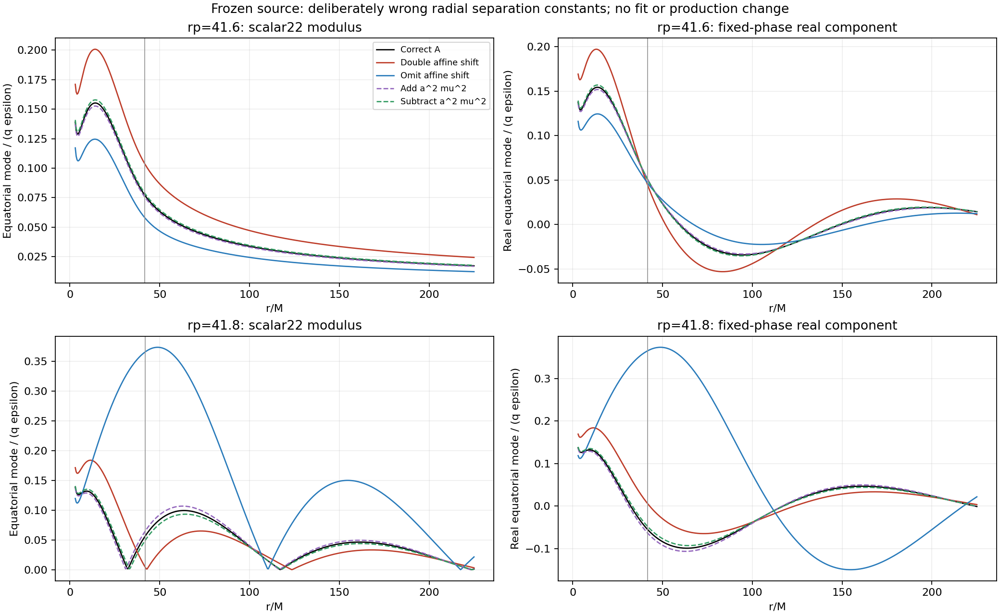

# 固定图5源的径向分离常数错误控制实验

这是对后续论文已指出的“分离常数错误”类别作的定量控制，不是对生产算法的修改，也不是认定作者旧程序采用了其中某一种表达式。结果说明这类错误可以移动传播阈值以下的驻波节点，局部幅度可出现数倍差异；但这里检验的常见写法不能一致解释图5两个轨道所有位置约4倍的差距。

## 冻结项与明确修改的方程

直接使用当前图5所用rp=41.6、41.8的scalar(2,2)原始源样本。源、频率、质量、角向S、场归一化、视界通量公式及积分边界全部固定；只在独立进程中让径向求解器接收到A+dA，齐次边界展开也使用同一改变后的A。离开构造器即恢复进程绑定，磁盘生产模块未改。

径向方程明确写为

`(Delta R′)′ + [K²/Delta − mu² r² − A − C − dA]R = J`，

`C = a² omega² − 2 a m omega`，正确生产实现对应dA=0。

测试的七项为：0、+C、−C、+a²mu²、−a²mu²、+a²omega²、−a²omega²。+C相当于重复加入A→lambda的仿射转换，−C相当于省略转换。质量项/频率项模拟相关分离约定未同步转换而残留一个常数的情况。非零dA都刻意保留原角函数和源，所以是错误方程的控制实验，不能称为另一套等价formalism。

| 轨道 | 正确A | C |
|---|---:|---:|
| 41.6 | 5.9999994652 | -0.983362572764 |
| 41.8 | 6.00000121568 | -0.983281694873 |

## 固定半径上的幅度和通量变化

下列为错误变体除以正确方程的比值。半径是BL r，场比较保留复振幅；表中为模长比。JSON同时存储所有复数值，不调整相位。

| 轨道 | 变体 | r=20 | r=50 | r=100 | r=200 | H通量比 | 无穷远通量比 |
|---|---|---:|---:|---:|---:|---:|---:|
| 41.6 | 重复C | 1.29057 | 1.36797 | 1.39440 | 1.41042 | 1.30919 | 2.02064 |
| 41.6 | 省略C | 0.79810 | 0.73671 | 0.72131 | 0.71307 | 0.79138 | 0.50031 |
| 41.6 | +a²mu² | 0.98328 | 0.97842 | 0.97704 | 0.97625 | 0.98264 | 0.95199 |
| 41.6 | −a²mu² | 1.01715 | 1.02209 | 1.02353 | 1.02436 | 1.01784 | 1.05049 |
| 41.8 | 重复C | 1.72093 | 0.35776 | 0.97373 | 0.89750 | 1.31095 | 非传播，均为0 |
| 41.8 | 省略C | 2.79932 | 4.44071 | 1.90316 | 2.36342 | 0.79100 | 非传播，均为0 |
| 41.8 | +a²mu² | 0.93810 | 1.09981 | 1.03706 | 1.04669 | 0.98261 | 非传播，均为0 |
| 41.8 | −a²mu² | 1.05706 | 0.91533 | 0.97131 | 0.96295 | 1.01788 | 非传播，均为0 |

±a²omega²与±a²mu²在这两个近阈值频率下几乎重合，全部精确数值仍单独保存，没有混为同一项。

在传播侧rp41.6，最剧烈的±C使各点幅度变化约20%–41%，同时使H通量变化约−21%或+31%、无穷远通量约减半或加倍。它不是“改相位但通量不动”。±a²mu²使无穷远通量约−4.80%/+5.05%，但不足以产生整个空间一致的4倍幅度差。

在非传播侧rp41.8，驻波干涉更敏感：省略C在r=50的幅度变为正确值的4.4407倍，但在其他三点分别为2.7993、1.9032、2.3634倍；重复C在r=50反而只剩0.35776。不能选一个点的接近程度来宣称找到原作者具体bug。

## 节点与形状变化

以r=3..225、间隔0.5的固定网格寻找模长的显著局部极小，rp41.8的正确结果在约32、117、223.5处有驻波极小；重复C后约43、123.5；省略C后约110.5、217.5。质量项小改变主要产生约0.5–1的极小位置漂移。这是位置诊断，极小搜索网格的0.5分辨率不支持更多小数。

## 数值控制与结论边界

14例的观测半径Wronskian相对变化最多6.22e-11。独立原始Gauss节点ZH与连续源插值ZH差别最多9.89e-10。因此表中的数倍或几十个百分点变化来自刻意改变的方程，而非明显的积分失败。

此实验只改变径向常数，未模拟“同时改变角函数及其源投影”的旧实现；不能穷尽所有错误类别。只有已公开的错误类别，没有公开旧程序的具体表达式，故不能把最接近某个图点的变体指定为真，更不能把错误方程写入生产代码去拟合图像。

原始文件和实现指纹、两端复振幅、通量、逐点复场、整条径向曲线与极小位置均保留于 `environment_reproduction/field_reconstruction_separation_variants_20260917.json`。脚本 `src/report_field_reconstruction_separation_variants.py`，图另有PDF版本。
