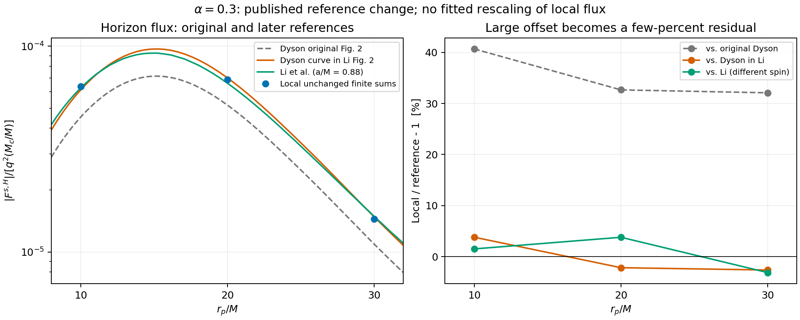

# Kerr 大幅视界偏差的主因：旧参考曲线的归一化错误

2026-09-16，接续对用户诊断报告的复核。

**本轮找到了解释原来约 32.7% 大偏差的直接文献和定量证据：用来验证本地计算的 Dyson 原视界曲线，后来已经因归一化问题被修正。保持本地计算完全不变，改与后续研究展示的 Dyson 参考曲线比较，\(r_p=20M\) 的差异从 +32.66% 变成 −2.16%。** 仍有几个百分点的视界残差，不能宣称全部模式和参数已达到最终精度。

上一轮没有检索到这条更直接的后续文献，因而“尚无公开证据证明原结果有错”的判断需要更新。上一轮关于 vector 漏项效果方向相反的实验结论仍然成立；那个真实的公开代码缺陷不是这里的大偏差解释。

## 1. 文献明确指出原结果的两项错误

Li 等的 *Extreme mass-ratio inspiral within an ultralight scalar cloud I. Scalar radiation*，[arXiv:2507.02045v2](https://arxiv.org/html/2507.02045v2)，引言脚注 1 明确说明修正了 Dyson 工作中的两个问题：

1. 标量场方程的椭球分离常数。
2. 视界通量的归一化因子。

同文图 2 展示其独立计算和 Dyson 数据的比较；致谢说明曾获得 Dyson／Spieksma 提供的数据及验证协助。这比仅从后来的公开代码副本猜测历史计算链更直接。

**证据边界：**公开正文没有列出旧程序中具体写错的代码或旧错误表达式；该文原 TeX 包也没有原始通量数组和完整程序。因此，下面对具体面积因子的判断来自几何推导和新旧矢量图的独立定量比较，不能写成“已看见作者旧代码把某一行写错”。

原 TeX、图文件和下载散列位于 `outputs/paper_original_reference/li_2507_02045v2/`；独立参数审查见 [PAPER_PARAMETER_CONVENTION_REAUDIT_20260916.md](PAPER_PARAMETER_CONVENTION_REAUDIT_20260916.md)。

## 2. 新旧参考值的改变足以解释原来的大幅偏差

统一使用每单位 \(q^2\eta\) 的视界有效轨道能量通量，\(\eta=M_c/M\)。图示量按 \(\epsilon^2=\alpha^6\eta\) 转换，\(\alpha=0.3\)。以下表格列绝对值，目标模式的有符号视界有效通量为负。

| \(r_p/M\) | 本地既有结果 | Dyson 原图 | 后续图中的 Dyson 结果 | Li 独立计算 |
|---:|---:|---:|---:|---:|
| 10 | \(6.35768\times10^{-5}\) | \(4.51961\times10^{-5}\) | \(6.12433\times10^{-5}\) | \(6.26220\times10^{-5}\) |
| 20 | \(6.86673\times10^{-5}\) | \(5.17638\times10^{-5}\) | \(7.01813\times10^{-5}\) | \(6.61523\times10^{-5}\) |
| 30 | \(1.44518\times10^{-5}\) | \(1.09412\times10^{-5}\) | \(1.48391\times10^{-5}\) | \(1.49157\times10^{-5}\) |

相对差异的变化：

| \(r_p/M\) | 本地相对 Dyson 原图 | 本地相对后续 Dyson 曲线 | 本地相对 Li |
|---:|---:|---:|---:|
| 10 | +40.67% | +3.81% | +1.52% |
| 20 | +32.66% | −2.16% | +3.80% |
| 30 | +32.09% | −2.61% | −3.11% |

本地数值全部保持原样，没有乘补偿系数、相位拟合或删掉物理分量。改变的是参考对象。数据来自原始 PDF 矢量路径，脚本按刻度校准并在对数坐标中插值，不是凭截图读数。[机器结果](environment_reproduction/li_reference_comparison_20260916.json)保留 PDF 散列和校准信息。

两个限制必须保留：PDF 曲线不是原始数值表；Li 实际使用 \(a=0.88M\)，而本地／Dyson 精确同步云使用约 \(a=0.877153M\)。上面的几个百分点不能当作同参数、全收敛情况下的代码误差。改变折线插值为单调三次插值，所测参考值变化约 0.0036%–0.102%；这是插值敏感性指标，不是严格读图误差界。

## 3. 为什么偏偏是 Kerr 视界，Schwarzschild 却能对上

从正确的 Kerr 视界通量直接推导。令标量模式

\[
\Phi=R(r)S_{\ell m}(\theta)e^{-i\nu t+im\varphi},
\quad \int |S_{\ell m}e^{im\varphi}|^2d\Omega=1,
\]

取入射径向行为

\[
R\sim Z_H e^{-ik_H r_*},\quad
k_H=\nu-m\Omega_H,\quad
\frac{dr_*}{dr}=\frac{r^2+a^2}{\Delta}.
\]

由 \(j^r=2g^{rr}\operatorname{Im}(\bar\Phi\partial_r\Phi)\)、\(g^{rr}=\Delta/\Sigma\)、\(\sqrt{-g}=\Sigma\sin\theta\)，流入视界的电荷率为

\[
N_H=-\int \sqrt{-g}\,j^r\,d\theta d\varphi
=2(r_+^2+a^2)k_H|Z_H|^2
=4Mr_+k_H|Z_H|^2.
\]

普通波能量流为 \(\nu N_H\)。扣除云的能量变化后，论文的有效轨道能量通量为

\[
F^{s,H}=(\nu-\omega_c)N_H
=4Mr_+m_g\Omega_p(\nu-m\Omega_H)|Z_H|^2.
\]

这一公式与本地 `environment_cloud.py`、Dyson 印刷公式以及 Li 的式 (61b) 相符。**印刷公式正确，不意味着生成旧图的数值归一化也正确**；这正是此前只核公式而没有找到后续修正数据时无法区分的一点。

若数值归一化把应有的 \(r_+^2+a^2\) 误当成 \(r_+^2\)，补偿因子就是

\[
\boxed{\mathcal C_H=\frac{r_+^2+a^2}{r_+^2}=\frac{2M}{r_+}}.
\]

对于图中标称 \(a=0.88M\)，

\[
\mathcal C_H=1.355956396.
\]

而直接读取新旧 Dyson 曲线得到

\[
\frac{|F_{H,\rm new}|}{|F_{H,\rm old}|}
=1.35506,\;1.35580,\;1.35626
\quad(r_p/M=10,20,30).
\]

在 \(5\le r_p/M\le40\) 的 141 个比较位置，该图形比值与上述预先给定几何因子的最大相对偏离约 0.246%；与此同时，无穷远新旧曲线最大变化约 0.097%。这构成了**只作用于视界的面积／幅度归一化因子的强烈数值特征**。这里没有用本地解拟合乘数。

在 Schwarzschild 极限 \(a=0,r_+=2M\) 时，\(\mathcal C_H=1\)。因此该错误可以在 Schwarzschild 检验中完全隐藏，却在高自旋 Kerr 中产生约 35% 的视界偏差；这解释了此前最难理解的背景依赖。

注意：以精确同步自旋 \(a=0.877153\ldots M\) 计算的几何因子为 1.351158756，而图形修正接近标称 0.88 所给的 1.355956396。两者相差约 0.36%。这提示后续图形或修正采用了标称参数；没有作者中间数组时，不应将这个差异自行抹平或假装旧代码细节已经确定。

## 4. 无穷远的小偏差还包含模态截断不一致

Li 正文（原 TeX 第 731 行）明确把两端总通量求和到标量 \(0\le\ell\le5\)。此前本地沿用 Dyson 原图设置：无穷远 \(\ell\le6\)，视界 \(\ell\le5\)。把不同截断的总和直接比较，会把额外的 \(\ell=6\) 辐射误算成误差。

从已有逐模态数据重新求和，统一为 \(\ell\le5\)，并不重调任何模式：

| \(r_p/M\) | 本地无穷远 \(\ell\le5\) | Li 无穷远 | 相对差异 |
|---:|---:|---:|---:|
| 10 | \(7.26782\times10^{-6}\) | \(7.26321\times10^{-6}\) | +0.063% |
| 20 | \(1.89876\times10^{-5}\) | \(1.89431\times10^{-5}\) | +0.235% |
| 30 | \(2.70661\times10^{-5}\) | \(2.69188\times10^{-5}\) | +0.547% |

这不是宣称两套程序完全相同：自旋略有差别，源和模态范围也仍是有限精度。但它说明原来约 5% 的无穷远差异不能直接用来判断本地算法有误；更合适的独立参考与一致的模态截断给出明显更好的结果。

## 5. 分离常数应如何写，本地是否需要改

为消除符号命名歧义，令角向本征值为 \(A_{\ell m}\)：

\[
\left[\frac1{\sin\theta}\partial_\theta(\sin\theta\partial_\theta)
+a^2(\nu^2-\mu^2)\cos^2\theta
-\frac{m^2}{\sin^2\theta}+A_{\ell m}\right]S=0.
\]

径向分离常数则为

\[
\lambda_{\ell m}=A_{\ell m}+a^2\nu^2-2am\nu,
\]

径向方程为

\[
\partial_r(\Delta\partial_rR)
+\left[\frac{((r^2+a^2)\nu-am)^2}{\Delta}
-\mu^2r^2-\lambda_{\ell m}\right]R=J_{\ell m}.
\]

本地函数接收名为 `lam` 的角向值 \(A\)，然后显式加入 \(-a^2\nu^2+2am\nu\)，所以最终径向势是正确的 \(-\lambda\)。命名相近不代表把两种常数混用了；同样必须使用有质量角参数 \(a^2(\nu^2-\mu^2)\)，不能未经转换替换为无质量值。

Li 的正确方程也采用这一关系。因此**没有依据修改本地分离常数来贴合旧图**。后续论文虽明确指出旧工作有这类错误，但没有公开旧实现的精确错误形式，尚不能将剩余每一个百分点定量分配给这个错误。

## 6. 本轮补上的数值排查

这些检查与新参考独立进行，结果没有支持本地几十个百分点的数值失真：

- **完整 KG 算子变分。** 对复解析扰动度规 \(g+\varepsilon h\) 直接计算坐标散度形式的 \(\Box\Phi\)，再中心差分并外推。该路径不用 Christoffel 或 Lorenz 化简。\(\ell_g\le4\) 的八个抽样包含轨道两侧、正负 \(m_g\) 和近视界位置；通常相对差为 \(10^{-12}\)–\(10^{-9}\)，在 \(r-r_+=0.005M\) 的病态 BL 点约 \(8.8\times10^{-7}\)。这是局部算子核验，不是独立度规或全域误差认证。[结果](environment_reproduction/direct_kg_variation_audit_20260916.json)
- **真正缩小近视界源截断。** 在明确延伸 trace／κ 与 Green 解的积分域后，将主导偶极内端从 \(5\times10^{-4}M\) 推到 \(5\times10^{-6}M\)，对完整基线的标量 00 通量修正约 −0.04468%；两支 Frobenius 外推约 −0.04535%。不是原来的 32.7%，也不是剩余数个百分点的主项。[结果](environment_reproduction/horizon_source_cutoff_r20_audit.json)
- **轨道接触项。** 直接投影两侧外推的 \(\Sigma[\bar h^{rb}]\partial_b\Phi_0\)，再乘目标 Green 核。改变角向节点、偏移和 Taylor 精度所得振幅修正在 \(10^{-6}\) 或更小量级，远小于此前需要的约 12%。高阶点值跳跃仍有截断／数值噪声，不能把这个目标投影结论扩大成逐点全度规已连续。[结果](environment_reproduction/orbit_source_matching_summary_20260916.json)

另发现一个真实的数值实现隐患：trace／κ 的默认径向积分从 \(r_++10^{-4}M\) 开始；若直接把源采样推得更内，SciPy 的 dense output 会静默外推。已有 \(5\times10^{-4}M\) 基线位于合法域内，没有因此改变。本轮内端诊断在单独明确扩展的积分域内计算；同时新增明确的越界拒绝防护，避免以后的“提高分辨率”测试实际使用未经控制的外推。防护不自动更改积分参数或合法基准值。新增 15 个越界回归用例，与原 κ 测试共 17 项通过；实际参数合法近视界点的 trace／κ 全部 Jet 系数在修复前后逐元素相同。旧诊断保留原计算时的源码散列，没有改写为新版本散列。

## 7. 现在应怎样表述结论

原来最显著的 Kerr 视界大偏差，主要由**旧参考结果的视界归一化错误**解释；“Schwarzschild 对、Kerr 不对”的模式有了几何和数值依据。它不是先前报告提出的 vector 偶极漏项，也没有证据要求把本地 MST／GSN／SWSH 算法换掉。

仍未完成的是：在完全相同的自旋、云频率及其虚部处理、源边界、角向和径向截断下，将剩余约 2%–4% 的视界差异降到受控容差。对 Li 数据的比较还涉及 \(a=0.88M\) 的准束缚云处理，正文给出的实数频率近似并不足以唯一确定其虚部保留／冻结策略。当前不能把这个残差全归咎于论文，也不能称为“完全复现”。

本轮对比修正保留原图作为历史参考，新增后续曲线和同 \(\ell\) 截断结果；没有给本地物理通量乘经验系数。此前只用旧图给出的“本地存在 32.7% 算法误差”的解读应停止使用。

复查入口：`src/report_li_reference_comparison.py`；[完整数值比较](environment_reproduction/li_reference_comparison_20260916.json)；[参数和文献证据](PAPER_PARAMETER_CONVENTION_REAUDIT_20260916.md)。
