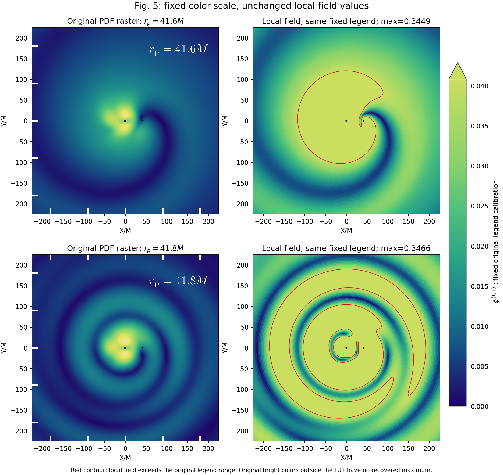
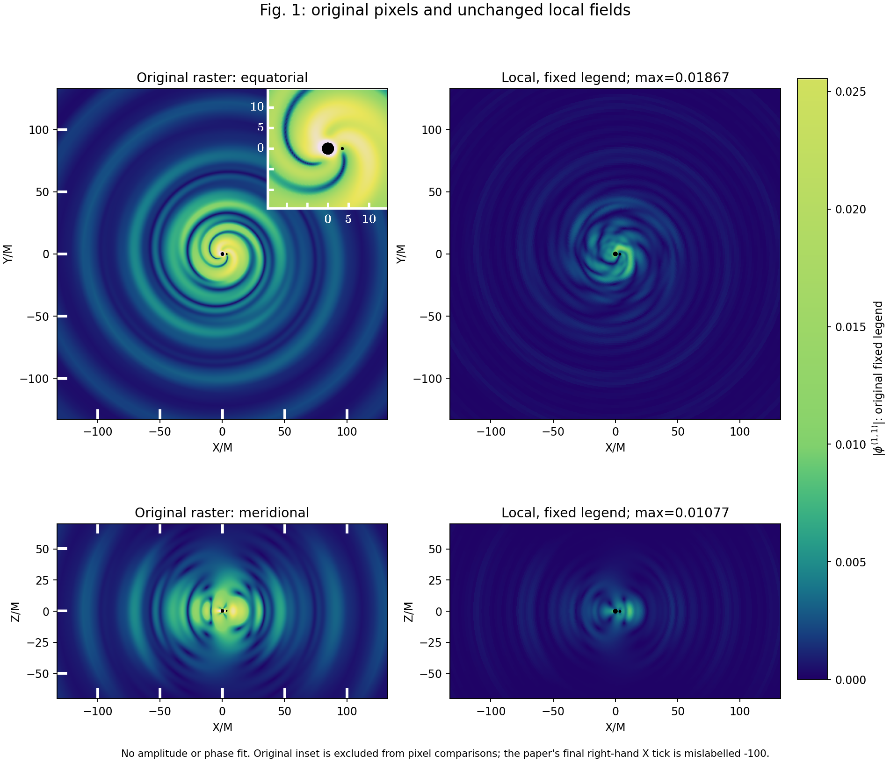

# 原始场图像素与 Fig.4 定义审查（2026-09-17）

本轮新增了可复核的原 PDF 像素证据，修正了先前“Fig.5 的原场最大值约0.04”的推断：**0.04 只是可见独立色条附近的上端，不是已知原场最大值。** 原场中心有颜色超出此色条覆盖的 RGB 范围，因此不能给出严谨的全域峰值比。与此同时，在色条内、没有文字或黑洞遮挡的固定坐标，原图反演与本地场仍有显著幅度及节点位置差异；统一色限没有消除它们。

## 可复核图与数据

左列保留原始栅格图，右列仅更换显示色限与颜色表；本地复场数值、角模态选择、相位均未改变。右列红线标出本地幅度超过原色条可读上端的边界。没有用一个拟合系数让两图接近。

- `environment_reproduction/figure5_pixel_comparison_20260917.json`：原 PDF 元数据、像素与物理轴定标、32个预先指定点、反演质量、SHA。
- `environment_reproduction/figure5_pixel_comparison_20260917.csv`：同一批固定点，含 RGB 容差对应的值区间。
- `environment_reproduction/figure5_original_legend_lut_20260917.csv`：原始色条每行的数值与 RGB，可直接复用。
- `src/report_paper_field_pixels_20260917.py`：完整可重复流程。读取现有求解结果，未运行或修改任何物理求解器。

## PDF 中实际包含什么

主源：[原 arXiv v1](https://arxiv.org/abs/2501.09806v1)、[TeX source](https://arxiv.org/src/2501.09806v1)。源包只有7个作图 PDF 与 TeX/bib 文件，没有 `.nb`、`.m`、数值表或场数组。

| 原文件 | 场面板图像 | 独立色条图像 | PDF 结构 |
|---|---:|---:|---|
| `BosonEMRIsFieldPlots.pdf`，Fig.1 | 2500×3864，RGB+透明度 | 375×2593 | 0文字、0矢量绘图、0嵌入附件、无XMP |
| `ResonanceBosonEMRIsFieldPlot.pdf`，Fig.5 | 2500×4746，RGB+透明度 | 375×3618 | 同上 |
| `plotTotal_onepanelSM_Ratio.pdf`，Fig.4 | 无栅格场图 | 不适用 | 20个矢量绘图对象，曲线可数字化，但不含作者数组 |

Fig.1 的 PDF Creator 是 Wolfram、创建于2024-12-20；Fig.5 Creator 也是 Wolfram、创建于2025-01-12。日期和 Creator 不包含场的复振幅、时间选择或绘图表达式。RGBA 像素只保留显示颜色，无法恢复复相位或被遮挡区域。

原图场中心的黄色超过独立色条顶部的黄绿色；这不是简单地把所有超过某个值的点饱和成同一顶色。Fig.5 两个面板共用同一独立色条图像，但公开产物没有给出每个场面板与这条色条之间的完整绘图设置。因此不能从色条反推出不可见的原始峰值，也不能排除原绘图自身的范围设置问题。

## 独立像素定标与固定点数值

原色条7个白色刻度中心行是 512.5、943.5、1374.5、1805.5、2236.5、2667.5、3098.5，对应 .035、.030、.025、.020、.015、.010、.005。线性定标只使用原图刻度，不使用本地场。可观测彩色条的行6..3520对应约 `[.00011021,.04087587]`。

场面板 X/Y 坐标由原白色刻度 −180、−90、0、90、180 标定。每个预先指定坐标读取5×5像素区域，只有其所有颜色到色条 LUT 的欧氏 RGB 距离≤3时才接收；不在颜色表内的明亮中心不做外推。约99.4%和99.2%的采样彩色像素满足此颜色条件，剩余区包含过色条的高值及文字/边缘混色。

| rp/M | 固定(X,Y)/M | 原色条反演值 | 本地原数值 | 本地/原像素 |
|---|---|---:|---:|---:|
| 41.6 | (−100,0) | .01237239 | .04789888 | 3.8714 |
| 41.6 | (100,0) | .00323086 | .01196108 | 3.7021 |
| 41.6 | (0,100) | .01248840 | .04755117 | 3.8076 |
| 41.6 | (0,−100) | .01115429 | .04205638 | 3.7704 |
| 41.8 | (−100,0) | .01196636 | .05219918 | 4.3622 |
| 41.8 | (100,0) | .00267401 | .01120341 | 4.1897 |
| 41.8 | (0,100) | .01196636 | .05081648 | 4.2466 |
| 41.8 | (0,−100) | .01115429 | .04692368 | 4.2068 |

在41.8的其他半径，差异并非单一乘法因子，例如(−50,−50)的比值约26.96，而(20,−20)约.928，图上也能看到径向节点的位置不一致。这表明不能以调一个整体场归一化代替问题定位。

这些值是**显示像素反演**，不是作者原始数值。颜色条是否严格用于原面板、纸面坐标是否就是本地 BL 平面嵌入，仍是解释条件。RGB 量化与5×5邻域区间完整写入 JSON；不得把表格小数位当作物理精度。原图侧保持原始栅格；右侧固定色限的饱和面积不等于物理体积。原本地数据的全域峰值仍是 .34485982/.34664805，但本报告不再用它们除以 .04 宣称原峰值相差多少倍。

## Fig.1 同样色条与可信坐标的补查

`figure1_pixel_comparison_20260917.{json,csv}` 含8个赤道点与8个子午点，排除了原图右上角的 inset。原色条上端约 .02555826，同样不能认定为原场的连续全局最大值。原图最右 X 刻度印成了 −100，但位置顺序与中心原点表明该位置应为 +100；坐标标定据其刻度顺序，不是拟合本地场。

| 赤道固定(X,Y)/M | 原色条反演 | 本地场 | 本地/原像素 |
|---|---:|---:|---:|
| (−100,0) | .001238329 | .000179289 | .1448 |
| (100,0) | .001522535 | .000332338 | .2183 |
| (0,100) | .000903372 | .000345247 | .3822 |
| (0,−100) | .003075519 | .000403338 | .1311 |

在这些固定坐标，本地场低于原图，方向与近阈值 Fig.5 相反。故一个同时施加到全部轨道的统一场幅度因子不能修复两类差异。该结论仍受原图色条映射与坐标约定的条件限制；没有拟合相位、旋转或删模态。所有16点的RGB残差≤2.45，区间和插值方法写入 JSON。

## 更合适的新场参考：Li 的公开 Fig.7

公开文件 `outputs/paper_original_reference/li_2507_02045v2/source/scalar_radiation_11.png` 的色条清楚标到约 .37，图标是 `|Phi^(1,1)|`。这提供了新的直接证据：独立计算的近阈值场可以具有本地约 .345 同量级的场，而不能继续把旧图色条约 .04 视作不可违反的物理峰值上界。

归一化来自 Li 原 TeX148、152–164行：其 ε=mp/M，即本地 q；ζ=α³sqrt(η)；物理扰动是 εζΦ^(1,1)。因此该图的 Φ^(1,1) 与本地 `deltaPhi/(q alpha^3 sqrt(eta))` 对应，**无需额外乘除α或4π**。

但必须使用其真实参数：a=.88、α=.3、rp=41.1/42.1、t=0、外半径200M、scalar ell2..5；不同于当前旧Fig.5的a=.877153、rp41.6/41.8、ell2..12。535行图注说所有ell2..5，626行正文说只累加能贡献∞通量的模式，后者对应六个正m通道 `(2,2),(3,3),(4,2),(4,4),(5,3),(5,5)`；两种文字需保留为歧义，分别给出六通道和完整18通道，不按哪个更像而挑选。图注又把赤道写成θ=0，与其极角谐函数约定矛盾，不能照字面在极点计算非零m场。

本轮已经产生可供严格对照的数组：

- `environment_reproduction/li_field_pixel_reference_20260917.{json,csv}`：16个固定(X,Y)点、圆环统计、参数、字段归一化、原图SHA。
- `environment_reproduction/li_field_polar_reference_20260917.npz`：两个轨道×9个半径×72个方位角，半径10、20、30、40、50、70、100、150、180M，φ=0向右、π/2向上，不旋转、不拟合。
- 数组字段 `nominal_abs_field`、`lower_color_interval`、`upper_color_interval`、`RGB_distance`；全部1296个像素RGB在原色条有精确匹配，无NaN。
- `src/report_li_field_pixels_20260917.py` 完整复算该参考。

这里必须使用区间而非逐点百分比：图为离散色带，同一个RGB对应一段色条高度。脚本将整段映射成区间，并计入印刷刻度的圆整。色条顶打印 `.37`，结合`.07,.15,.22,.30`等刻度，其实际最大值可在约 `[.36875,.375]` 内；以.37给名义值。例如(−100,0)在两轨道图中都是同一色带，名义幅度 .04415991，但可比较区间是 `[.04230156,.04649479]`。这是真实的显示分辨率限制，不是求解器的统计误差条。

本报告没有把这些不同参数的图与本地旧轨道直接相除宣称吻合。它们提供了更明确的新目标：先对准参数和模态范围，再检验场在颜色量化区间内是否相容。

## 原文支持的场变量、规范与时间

`main_PRL.tex` 的直接证据：

- 284–288行：物理标量展开为 `Phi=epsilon phi^(1,0)+epsilon q phi^(1,1)+...`，并定义 `epsilon=alpha^3 sqrt(Mc/M)`。因此按正文，所画系数是物理扰动除以 qε。
- 图注320、661行：画的是 `|phi^(1,1)|`。没有 rφ、平方 `|phi|²` 或只取实部的标记。
- 468–480行：场直接按标量椭球谐函数与 `exp[-i(omega_c+mg Omega_p)t]` 展开，径向场在∞按1/r衰减；进一步排除把这里的 φ 自动解释成 rφ。
- 681、701–702、740行：Lorenz度规先形成协变源，再投影到标量椭球谐函数，最后把求出的标量场模态求和。图注 ell≥2 指所绘标量场，不能据此删掉度规源中的所有低阶模态。
- 未找到场图的明确时间数值、精确帽笛卡尔坐标映射或方位角零点公式。图片中次级位于+X轴。未找到只保留正m的场图条件。

不过统一时间或方位角零点不是幅度峰值问题的自由旋钮。原文频率关系是 `omega_m=omega_c+(m−mb)Omega_p`，所以

\[
\phi(t,r,\theta,\varphi)
=e^{-i(\omega_c-m_b\Omega_p)t}
 F(r,\theta,\varphi-\Omega_p t).
\]

取绝对值后，时间变化只转动方位角。对一条完整径向圆环，最大值和角向 RMS 不变；径向依赖的方位坐标平移也保留该环的幅度分布。因此未声明 `t=0` 不能把整个环的幅度压低。非仿射的逐模态相位错误会改变干涉，但那是需要独立检查的实现问题，不能称作任意时间约定。

另一个并行独立验证见 `environment_reproduction/field_reconstruction_green_audit_20260916.json`：它通过 Green 积分及角函数独立检查场重构，并给出了由视界通量推导的低阶幅度下界。本报告的像素证据与该检查互补，没有用显示效果反向校准求解器。

## 版本与可公开的场修正

2026-09-17检查的 [arXiv条目](https://arxiv.org/abs/2501.09806) 仍只列v1；v2地址返回404。[APS记录](https://journals.aps.org/prl/abstract/10.1103/PhysRevLett.134.211403) 给出2025-05-28出版日期，正文/补充材料需要授权，本轮没有绕过此限制。

[Sheffield作者机构库的 accepted manuscript](https://eprints.whiterose.ac.uk/id/eprint/227286/8/Self_force_and_environments%20%282%29.pdf) 可公开访问。缓存文件 `accepted_2025.pdf` 的 SHA256 是 `69a6ad0fc933bae8774b1673e001016d2a4c82c8c61984665d118c368158099c`。其 Fig.5 场面板与色条的解码 RGB 字节分别与原 arXiv Fig.5 **完全相同**；Fig.1 色条也相同，场面板经过 JPEG 重压缩，RGB差异中位数0、99分位6，不能据此主张有物理数据修订。accepted 的 Fig.1/5图注和Fig.4参数矛盾仍在。

[Li et al. v2](https://arxiv.org/html/2507.02045v2) 确认 Dyson 比较数据有 separation constant 与 horizon normalization 两类修正，公开重绘的是通量比较。本轮没有找到公开的更正场数组或重绘 Fig.1/5；这是有范围的检索结果，不是宣称这些材料不存在。不能假定已知旧分离常数错误对近阈值场必然只有百分之几的作用，也不能用它未经验证地解释全部点值差。

## Fig.4：能修复比较定义，不能科学地强行对齐旧图

原正文354行定义 `mathcal F^s=(q²epsilon²)^−1(dot E^Phi+dot Mc)`，288行给出ε²=α⁶η。于是对于正文S.3取的 q=10^-6、η=.1、α=.3，从按该定义归一化的 Fig.2 乘回物理量的因子应为

\[
q^2\epsilon^2=q^2\eta\alpha^6=7.29\times10^{-17}.
\]

但Fig.4图注写 ε²=.1α³，对应 `2.7e-15`，与正文另不相同。原PDF矢量曲线数字化则给出 Fig.4/Fig.2 的 scalar 比值在rp10/20/30接近 `5.31441e-20=q² eta alpha^12`，既不等于前两种宣称。原∞图内 inset 也不是主图scalar/GW比：rp20为该比值的约.81984；H inset 则接近1。GW主图与独立单个正m(2,2)模式吻合到约10^-5～10^-3，而不是完整±m及各ell之和。这些是 `figure4_normalization_audit.json` 的直接跨图检查，**不是**读到作者旧绘图程序后得出的归因。

因此存在三个不能同时满足的目标：正文物理参数、图注参数、原图数值。不能通过改本地标量源或径向归一化去同时追它们。可科学修复的是明确选择正文物理参数η=.1，使用经更正、单位明确的标量参考通量，另用完整约定明确的GW模态和，重新画物理比较图；应标作“按正文参数重建的scalar/GW比较”，而不是“逐点复现原Fig.4”。原论文自己还指出所算scalar通量不包含所有同阶保守/引力项，因此新图也不应宣称完整环境修正后的总辐射。

所有产物未做幅度拟合、删模态或改动求解器。固定色限图已视觉复核；像素定标断言通过。
