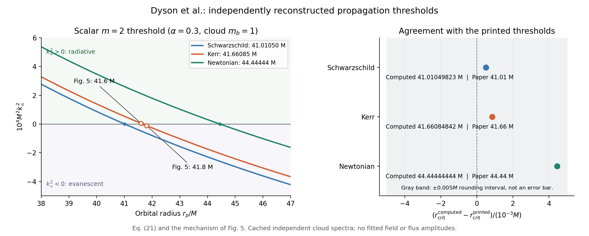

# Dyson 原论文逐图复现审计与独立阈值对照（2026-09-16）

这次可以称为“部分通量和阈值已基本对齐”，不能称为“整篇论文已复现、余差只是数值误差”。原论文视界通量参考值已有后来论文确认的归一化错误；改用修正参考后，早先约 32.7% 的差距大部分消失。这不同于证明本地求解器仅剩离散误差。图 1、5 的完整场幅度仍不吻合，图 4 的跨图归一化仍有实质疑点，图 7 的粒子处模态序列也未复现。

审计主源是 [Dyson et al., arXiv:2501.09806v1](https://arxiv.org/abs/2501.09806v1) 的[原始 TeX 与作图 PDF](https://arxiv.org/src/2501.09806v1)。本地 `outputs/paper_original_reference/arxiv_v1_source/main_PRL.tex` 的 SHA256 为 `cc1434ceb6eec54b3dbfbf69cbda528bc787ba8e8571eaa9278a2b23bef884b1`。图号按原始 TeX 的包含顺序；图 1、2 是正文图，图 3–7 是补充部分。

## 图号、现有数据与缺口

表内文件默认位于 `docs/environment_reproduction/`。存在结果文件仅表示相应有限计算确实完成，不自动表示收敛或与原论文对齐。

| 原图及 TeX 行号 | 物理内容、参数与原始图文件 | 本地可核对结果 | 审计结论与具体缺口 |
|---|---|---|---|
| Fig. 1，319–321 | 扰动场 `|phi^(1,1)|` 的赤道、子午切片；α=.3，a 在图注写 .88，rp=3.5，scalar ell≥2；`BosonEMRIsFieldPlots.pdf` | `wake_diagnostic_rp3.5_L18_sl12_mixed_wide_linear_eps.{json,npz,png}`；ell=2..12 的 88 个场模态均具备；赤道最大值 .01866553，子午 .01076830 | **未定量复现。** 原图色标约 0..0.025，本地全场结构和远场幅度仍不同。当前用 BL 标签的平面嵌入，原文帽坐标的精确定义未确认。缺失的是完整场比较和系统收敛，不能仅归因于没有作者数组。 |
| Fig. 2，343–345 | Kerr/Schwarzschild/Newtonian 标量轨道能量通量；α=.2/.3，随 rp；∞ ell≤6，H ell≤5；`Flux_Inf_Hor_TwoPanels_2.pdf` | `report_figure2_radii.py`、`report_background_total_comparison.py` 和 coverage JSON；α=.3 Kerr 多个 rp、α=.3 Schwarzschild rp20、α=.2 Kerr rp20 具备有限总和；父任务另制修正参考对照 | **部分基本对齐，未完成整张双面板径向扫描。** α=.2 Schwarzschild 的现有 coverage 为 ∞0/9、H0/18。旧 H 参考需和 Li 的修正版分开，不能拟合本地通量去追旧错误曲线。 |
| Fig. 3，575–577 | 以 Dyson 的 Schwarzschild 为基准，比较 Kerr 与 Schwarzschild 以及 Brito 的 Schwarzschild；α=.2/.3；`RelDiffFlux_Inf_Hor_TwoPanels.pdf` | `background_r20_paper_comparison.json`、相应 Kerr/Schwarzschild 单点数据 | **未复现完整曲线。** 只有有限单点；α=.2 Schwarzschild 未计算，Brito 数值曲线未取得，且旧 H 曲线受已知归一化问题影响。当前 frozen Schwarzschild 是保留复径向本征函数、冻结时衰减的近似。 |
| Fig. 4，640–642 | 加物理微扰因子的 scalar/GW 通量及比值；q=10^-6，α=.3，图注 ε²=.1α³；`plotTotal_onepanelSM_Ratio.pdf` | `figure4_normalization_audit.json`、`paper_figure4_selected_radii.json`、`gravitational_flux_r20_L12.json` 等 | **未复现。** 跨 Fig.2/4 比值显示 scalar 曲线有额外 α^6 的代数指纹；GW 更接近单个正 m 的(2,2)而非完整总和；inset 也非始终等于主曲线比值。这是对图的证据，不能伪称已知作者实际程序。原文 ε=α³ sqrt(eta) 与本图注也需区分。 |
| Fig. 5，660–662 | 阈值两侧的赤道扰动场，α=.3，a≈.88，rp41.6/41.8，ell≥2；`ResonanceBosonEMRIsFieldPlot.pdf` | `figure5_threshold_wakes.{json,npz,png}`、`figure5_complete_inventory_audit.json`；每侧 88 个场模态，ell≤12；本轮新增下述独立阈值图 | **阈值已核实，完整场幅度未复现。** 两侧本地最大值 .34485982/.34664805（per qε），原图色标约0..0.04，近中心形态也不同。不能把约一个量级的色标差叫作读图误差。个别 m=2 Green 边界重复到10^-7或更小，只验证该固定源的边界敏感性，不验证全场正确。 |
| Fig. 6，670–672 | rp20、α=.3，逐 scalar(ell,m) 的∞通量，ell2..12，只有允许的正 m≥2；`Flux_l_mode_convergence_inf.pdf` | `figure6_progress_L18.{json,png}`、`paper_v1_flux_markers.json`；36/36 有限模态齐备；父任务另制新叠图 | **有限模态比较已完成，未获得全误差预算。** 与旧图可读 marker 的总和比约1.05039；弱高阶模态偏差不统一，(12,6)约32.5%。不得用约5%的整体因子“校准”求解器，更不能把各模态残差全部宣称为数值误差。 |
| Fig. 7，754–756 | rp20、粒子位置的场 ell 模态，预期 ell^-2；正文748行先定义 sum_m phi_lm；`Flux_l_mode_convergence_particle.pdf` | `particle_field_L18.json`：ell2..12各壳完整；`particle_spherical_projection.json`、`particle_field_cutoff_comparison.json`、`paper_figure7_markers.json` | **未复现。** 径向系数和角向加权的物理场是不同量，已有两种输出未与原图定量对齐。球面重投影能重构有限输入到约10^-14，只说明角向变换一致，不证明 ell^-2 尾部；输出 ell>12 只是已有模态的混合。旧 L6/nt10→L18/nt18 是联合参数改变，不能当单一截断收敛率。 |

## 本轮新交付：Fig. 5 的传播阈值独立对照

计算沿用已独立得到的云本征频率，仅在本轮重算解析阈值与远区色散关系，并没有重跑、拟合场幅度或通量。对云 mb=1、扰动 scalar m=2：

\[
\omega=\operatorname{Re}\omega_c+\Omega_p,
\quad \Omega_p=(r_p^{3/2}+a)^{-1},
\quad k_\infty^2=\omega^2-\mu^2,
\quad r_{\rm crit}=\left[(\mu-\operatorname{Re}\omega_c)^{-1}-a\right]^{2/3}.
\]

这是原文 Eq.(21)、TeX366–374行与 Fig.5 前的654–655行所述机制：径向∞解从辐射变为指数衰减。它是质量传播阈值，不能因为原始图文件名含 `Resonance` 就把它当作准束缚态的共振极点。

| 背景 | 本地 Re(Mωc) | 本地 rcrit/M | 原文数值 | 本地−印刷数值 |
|---|---:|---:|---:|---:|
| Schwarzschild | .296192346398999 | 41.010498225546 | 41.01 | +.000498225546 |
| 同步 Kerr，a=.877153027594937 | .296293248479757 | 41.660848417923 | 41.66 | +.000848417923 |
| Newtonian n=2 | .296625 | 44.444444444444 | 44.44 | +.004444444444 |

三者均落入论文两位小数的末位舍入区间 ±.005M；这不是对作者数值结果的严格误差条。Kerr 两侧射击与独立400项、50位精度 Leaver 连分式所得阈值仅差 `4.72e-11 M`，射击的边界改变为 `2.76e-10 M`。这些检验针对背景本征值，不能外推为所有强迫响应的误差。

| Fig.5 轨道 | Mω | M²k∞² | 远区分支 | 远区尺度 |
|---|---:|---:|---|---:|
| rp=41.6M | .300008109274042 | +4.86563018541e-6 | 辐射 | 波长 2π/k = 2848.4613M |
| rp=41.8M | .299981565664244 | −1.10602616289e-5 | 倏逝 | 衰减长度 1/abs(k) = 300.6888M |

长程 Coulomb 相位仍需处理；上述尺度仅是渐近值，不能用全域平面波替代径向解。Schwarzschild 云本征频率实际含 Im(Mωc)=−9.45565166960e-6；此表按论文公式使用其实部，也明确保留虚部元数据。

新产物：

- `src/report_paper_threshold_comparison_20260916.py`：只读缓存本征谱、重算阈值、断言分支与舍入一致性、生成图表；未修改任何物理求解器。
- `docs/environment_reproduction/paper_threshold_comparison_20260916.{png,pdf,json,csv}`：图、PDF、输入 SHA 与检查、阈值表。
- `docs/environment_reproduction/paper_threshold_comparison_20260916_figure5_orbits.csv`：两轨道的频率、k²、渐近分支与长度。
- `docs/environment_reproduction/paper_threshold_comparison_20260916_curves.csv`：图中1001个轨道半径的三种 k² 曲线，全部由上述公式得出。
- `docs/PAPER_REPRODUCTION_FIGURE_AUDIT_20260916_manifest.json`：本审计的主要输入与产物 SHA。

PNG 已人工视觉复核，修正了一处标注重叠；最终标签与坐标未裁切。脚本全部断言通过。

## Fig.5 的 ell、负 m 与静态扇区能否解释幅度差

公开证据支持图注的 ell≥2 是**所绘标量扰动场的多极选择**，不能解释成从度规源里删去所有 metric ell<2：图注660–662行明确画 `|phi^(1,1)|`；701–702行先把张量收缩源投影到标量椭球谐函数，740行说把 Klein–Gordon 解 `phi^(1,1)_ellm` 对 ell、m 求和重构场；681行另行定义 metric 的球谐 ellmax=18。公开文字没有一条授权为了场图而把度规低阶源全部删去。

原文未给出 Fig.5 只取正 m 的条件，740行是 sum over ell and m，748行对粒子处场还明确写 m=−ell..ell。Fig.6 正 m 的限制来自**∞通量**的传播及选择规则，不能移植到空间场幅度。当前每侧88个场模态已含允许的负 m 与 scalar m=1 静态扇区，因此“本地漏掉这些扇区”不是本数据集的缺口；至于作者未公开的绘图流水线是否有额外筛选，文字不足以确定。不能把删去某些 m 后更接近图色标当作已经复现作者约定。

现有 `figure5_static_split.json` 给出直接的复场相减检查（先减复场，再取绝对值）：

| rp/M | 完整场 max | static scalar m=1 max | 删去 static 后 max |
|---|---:|---:|---:|
| 41.6 | .3448598217 | .0118807339 | .3448314244 |
| 41.8 | .3466480502 | .0118611054 | .3466197824 |

静态扇区显然不能解释从约 .345 降到原图约 .04 的差别。相应源文685行提到的 metric(1,0) completion 只影响 scalar m=1，也因此不能单独解释当前峰值差。此处没有运行新的删模态拟合或声称已排除所有静态完成项的实现误差；结论只针对已有 `static_split` 计算的实际扇区大小。

## 为什么余差仍不能统称数值误差

[Li et al., arXiv:2507.02045v2](https://arxiv.org/html/2507.02045v2) 的脚注确认原 Dyson 结果有 separation constant 与 horizon normalization 两类修正。Li 实际用 a=.88，而本地同步云用 .877153...；Li 的 Fig.2 通量两端都截到 scalar ell≤5，Dyson 原图是∞≤6、H≤5。按相同 ell≤5 比较，本地∞相对 Li 在 rp10/20/30 的偏差降到 +.0634%、+.2349%、+.5473%；H 仍约 +1.52%、+3.80%、−3.11%。这些支持“部分通量基本对齐”，不支持全篇复现。

余差里尚混合：真实参数差异、印刷曲线数字化误差、尚未确定的复频率处理、源与模态截断误差，以及仍未排除的实现约定差异。尤其 Fig.1/5 全场还明显不符。只有在相同 a、频率、云归一化、角模态范围下，分别提高径向/角向/源截断精度并给出误差区间，才能把剩余残差中的某一部分定量归为数值误差。前述极高精度的本征频率检查或单个 Green 函数重复不能代替这一步。
