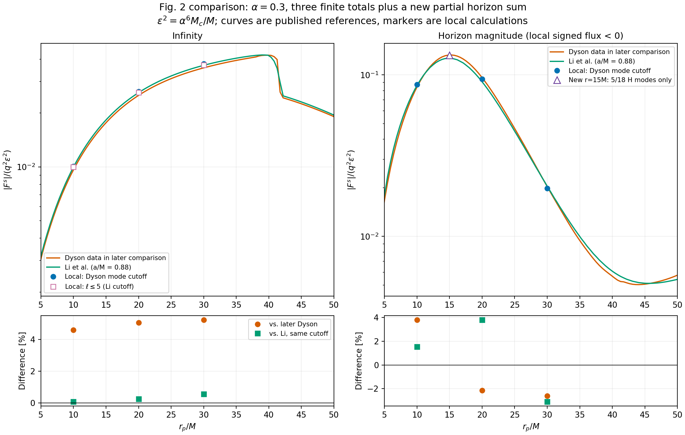
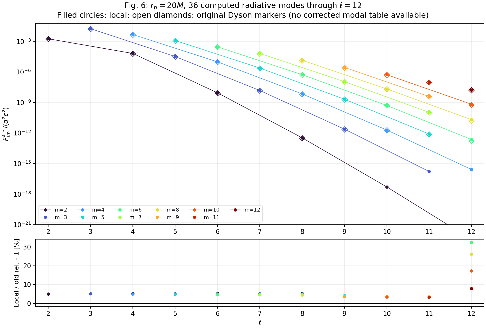
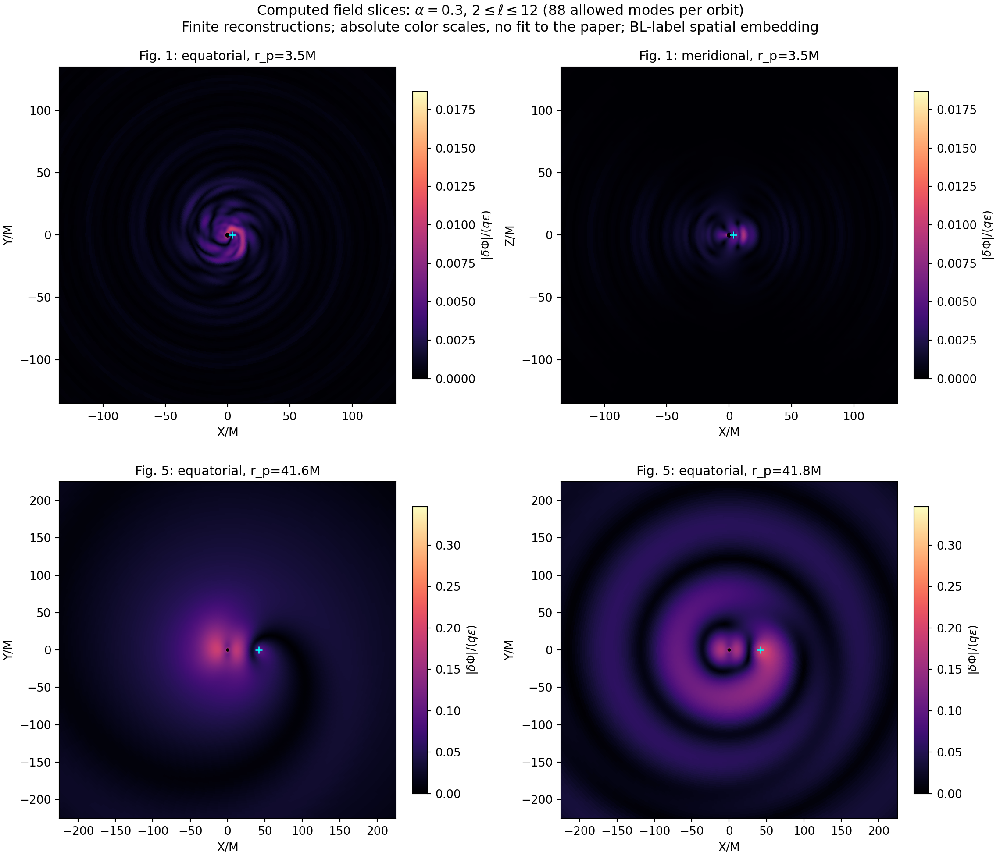
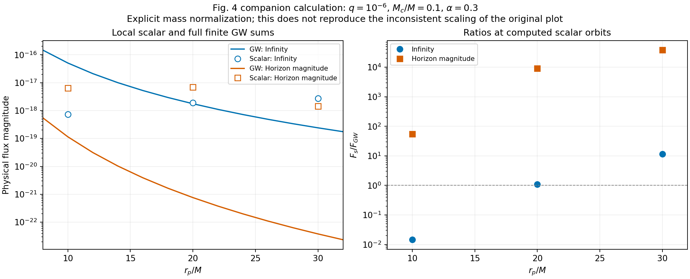

# Dyson 等 Kerr 环境效应：复现图与数值结果

2026-09-16。当前分支 `codex/reproduce-kerr-environment`。

## 可以怎样表述目前的一致程度

**在已计算的 α=0.3、rp/M=10、20、30 三个轨道处，总标量通量与后续独立结果达到百分之几的一致；还不能说剩余偏差已经被证明仅来自数值误差，也不能说论文所有图已定量复现。**

Li 等明确修正了 Dyson 的标量分离常数和视界通量归一化。改用后续参考即可消除原来的大视界偏差，但本地与 Li 的自旋以及云频率处理仍不完全相同。无穷远对 Li 的小差异与对 Dyson 的约 5% 差异同时列出，避免只选择较接近的一组参考。

- [Dyson 原论文](https://arxiv.org/html/2501.09806v1)
- [Li 后续独立计算及脚注 1](https://arxiv.org/html/2507.02045v2)

本轮图表由保存的逐模态解、复场数组和原始矢量参考图生成，并逐个核验原始数值、求和以及文件散列。新半径和加密计算单独标注。没有将参考曲线当成本地扫描，也没有给本地通量乘经验系数。

## 图 2：总通量与更新参考

本地背景 a/M=0.8771530275949366，Mωc=0.29629324847975713；Li 使用 a/M=0.88。下表统一两端标量 ℓ≤5，与 Li 截断一致。单位为 q²η，η=Mc/M；视界列保留有效轨道能量通量的负号。

| rp/M | 本地无穷远通量 | 本地视界通量 | 无穷远相对 Li | 视界相对 Li |
|---:|---:|---:|---:|---:|
| 10 | 7.267815990e-06 | -6.357677061e-05 | +0.0634% | +1.5247% |
| 20 | 1.898757035e-05 | -6.866732370e-05 | +0.2349% | +3.8019% |
| 30 | 2.706614698e-05 | -1.445175581e-05 | +0.5473% | -3.1107% |

图上曲线为发表参考数据，标记为本地独立计算点。原 Dyson 截断为无穷远 ℓ≤6、视界 ℓ≤5；紫色空心方块另按 Li 的 ℓ≤5 求和。图中的纵轴为 q²ε² 单位，ε²=α⁶η，与表格只差已知单位换算。

[逐点完整结果](figure2_flux_values.json)；[单独保存的发表参考曲线](figure2_published_reference_curves.json)。参考来自 PDF 曲线读取，不是作者原始数组，不给出虚假的严格误差棒。

## 本轮新算的 rp=15M：明确保留未算通道

从新的度规采样开始，本轮算出 6 个标量通道；每通道 96 个源节点、度规 ℓg≤18、角向18点、源外端320M。所有通道的当前源码来源验证通过。

| 边界 | 目标截断内已算通道 | 本地部分和 / (q²η) | 更新 Dyson 全量参考 | Li 全量参考 |
|---|---:|---:|---:|---:|
| 视界 | 5/18 | -9.6570877282e-05 | -9.6815579476e-05 | -9.2494982753e-05 |
| 无穷远 | 3/9 | 5.0837464717e-07 | 1.2858078808e-05 | 1.3328880696e-05 |

视界部分和相对更新 Dyson 总量约低 0.253%，但这不是完整总通量误差。图2用独立的空心三角表示它；残差面板只包含三个完整有限求和点。无穷远主要通道尚缺，部分和仅约占旧参考的3.95%，所以没有把它放到总通量曲线上。

[新半径全部复振幅、六模态通量、缺模列表](figure2_rp15_partial_values.json)；[更新参考的独立插值](figure2_rp15_updated_reference.json)。本地 JSON 明确将未完成的 total 设为 null，而不是用部分和或零替代。

## 图 6：逐模态无穷远通量

在 rp=20M，已计算 ℓ=2…12 的 36 个非零辐射通道。图示实心圆为本地计算，空心菱形为 Dyson 原版图 6 的读数；尚无修正后的作者逐模态表，不能用总通量的接近代替逐模态验证。

主要低阶模式相对原图仍约高 5%。ℓ=12 的部分极小模式相对差异可达约 32%，但该整个壳层只占已算无穷远通量的 6.77×10⁻⁷，不能混淆相对小模态误差与总通量误差。

| 标量 ℓmax | 无穷远有限和 / (q²η) |
|---:|---:|
| 5 | 1.898757034674e-05 |
| 6 | 1.921033696656e-05 |
| 8 | 1.927142176975e-05 |
| 10 | 1.927398579508e-05 |
| 12 | 1.927407369153e-05 |

ℓ≤6 到 ℓ≤12 的变化为 +0.33178%，ℓ≤5 到 ℓ≤12 为 +1.50890%。这些是已计算模态范围的截断敏感性，并非径向源、度规重构和无限模态尾部的联合误差上界。

[全部 36 模态及逐级求和](figure6_modal_values.json)。

## 图 1 和图 5：计算得到的场分布

各轨道均包含 2≤ℓ≤12 的 88 个允许模态，先相干求和复场再取绝对值。上排对应图 1 的 rp=3.5M；下排对应图 5 的 rp=41.6M、41.8M。颜色表示 |δΦ|/(qε)，不是密度、rΦ 或总背景云。

**这些场图尚未定量对齐原图。** 原图 5 的色标约为 0–0.04，本地网格的峰值约为 0.345、0.347；空间结构也有差别。峰值所在网格、坐标嵌入及规范需要共同核对，不能仅乘一个常数把颜色调成相似，就宣称复现。原图 1 的色标约至 0.025，本地赤道峰值约为 0.01867。

这里使用 BL 坐标标签的空间嵌入 X=r sinθ cosφ、Y=r sinθ sinφ、Z=r cosθ，取 t=0。该嵌入不是 Kerr–Schild 笛卡尔坐标，原论文具体绘图映射尚未完全确认。各模式保留原记录的有限离散参数。

[场统计与约定](figures1_5_field_values.json)；[图1复数场网格](figure1_complex_field.npz)；[图5复数场网格](figure5_complex_fields.npz)。

## 图 4 对应物理量：明确质量归一化后的结果

取论文正文示例 q=10⁻⁶、η=Mc/M=0.1、α=0.3，则 ε²=7.29×10⁻⁵。标量通量由每单位 q²η 的结果乘 q²η，引力通量由每单位 q² 的结果乘 q²。引力侧求和到 ℓ=12，包含正负 m。

| rp/M | Fs∞ / FGW∞ | FsH / FGWH |
|---:|---:|---:|
| 10 | 0.014458848 | 55.214861 |
| 20 | 1.0921753 | 9011.0062 |
| 30 | 11.396925 | 38037.176 |

这是一组定义明确的对应计算，不是原图 4 的逐点复现。原图图注 ε²=0.1α³ 与正文 η=0.1 不一致，先前跨图检查还发现原图缩放与 GW 单个正 m=2 模态相符的特征。因此这里不通过经验缩放追随旧图。不能只由这几个定常通量点推断浮轨道或长期演化。

[带符号通量和所有归一化因子](figure4_physical_flux_values.json)。

## 本轮新增的径向精度对照

在 rp=20M 固定物理参数、源边界、角向阶数和度规 ℓg≤4，将源节点 88→176，并将普通/近视界积分阶数 8/32→16/64。主导标量 (0,0) 的视界通量变化仅 **−2.31594×10⁻⁸ 相对量，即 −0.000002316%**。两次全新计算使用完全相同的源码来源指纹；粗网格与旧同参数结果只差 3.47×10⁻¹²。

这能排除这项受控径向精度变化是百分之几残差的来源，不能证明全部算法均无系统误差。此对照是 ℓg≤4，不冒充新算的全部 ℓg≤18 联合收敛认证。已测各项敏感性的绝对值合计约 0.04479%，主要来自前轮近视界尾部；它不是严格误差上界，更不能据此把未解释的 2%–4% 叫作数值误差。

[本轮精度对照与证据预算](remaining_horizon_error_budget_20260916.json)。

## 图 5 的传播阈值：与论文印刷数值一致

| 背景 | 本地 rcrit/M | 论文 |
|---|---:|---:|
| Schwarzschild | 41.0104982255 | 41.01 |
| 同步 Kerr | 41.6608484179 | 41.66 |
| Newtonian | 44.4444444444 | 44.44 |

三者均在论文最后一位的舍入范围内。Kerr 的独立射击法与 400 项 Leaver 连分式所得阈值相差 4.72×10⁻¹¹M。这一精度属于背景本征频率和传播阈值，不能移用为强迫场的精度。

rp=41.6M 时 M²k∞²=+4.8656301854×10⁻⁶，属于辐射分支；rp=41.8M 时为 −1.1060261629×10⁻⁵，属于倏逝分支。[阈值数值与来源](paper_threshold_comparison_20260916.json)。这是质量传播阈值，不是准束缚态共振峰。

## 整篇论文还缺什么

[七张图的逐项审计](PAPER_REPRODUCTION_FIGURE_AUDIT_20260916.md)列出各图参数、文件、完成度和缺口。特别是 α=0.2 Schwarzschild 的通量尚无完整计算；图 3 径向对照扫描、图 7 粒子处 ℓ⁻² 序列、图 1/5 绝对场幅度尚未复现。图 4 本次给出的是明确归一化的对应计算。

## 尚需区分的误差来源

1. 发表参考的已知错误：视界归一化和标量分离常数；后者的旧程序表达式未公开。
2. 模型约定差异：同步云与 a=0.88 准束缚云、自旋取值、云频率虚部、场的规范和绘图映射。
3. 本地数值敏感性：源积分、径向边界、角向/度规截断，以及小模态精度。

因此目前合理的结论是“部分关键观测量基本一致，并已复现相应物理结构和传播阈值”，而不是“系统误差已全部排除”。

## 数据和复算

所有 JSON 为机器可读数值；NPZ 保留复场本身；PNG 用于预览，SVG 用于矢量导出。[文件与输入散列清单](bundle_manifest.json)记录生成图表时的实际输入。本轮报告程序 `src/report_paper_reproduction_bundle.py` 只汇总验证和作图，不修改物理求解器。
