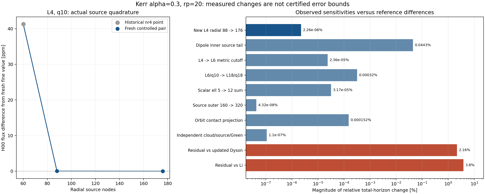

# Kerr 视界剩余偏差：数值误差预算复核

**目前不能认定剩余2%–4%只是数值误差。** 已实测的数值敏感性明显更小。本轮新增了包含非偶极项的实际源径向加密对照，未乘补偿因子、未改变物理公式。

## 本轮新增的受控对照

固定 alpha=.3、精确同步自旋、rp=20、scalar00、度规ell≤4、角向10节点、内外源边界和所有求解容差。只将各普通径向面板8点提高到16点、近视界对数面板32点提高到64点，即总源节点88→176。两次源均本轮真实计算，源码/包版本指纹一致。

- 粗网格 Z_H = -0.04961005400623556+0.03350534019744728j；F_H = -6.700729581277756e-05。
- 精网格 Z_H = -0.04961005331587023+0.03350533998106924j；F_H = -6.700729426093051e-05。
- 复振幅相对变化 1.20853e-08；通量相对变化 -2.31594e-08（-2.31594e-06%）。

这是包含spin0/1偶极以及ell2..4全部重构的直接源计算，补上此前只对L1做径向加密的缺口。它不是全L18新网格的误差认证。旧L4基准与本轮粗网格的变化单独记录；旧文件没有被伪装成当前版本。

## 占比与已观察到的变化

既有总视界通量中，scalar00占97.58281%，scalar22约占2.16812%。因此首先约束00通道，比只看极弱高阶模式的相对误差更有意义。

| 对照 | 相对总视界通量的变化幅值 | 证据范围 |
|---|---:|---|
| New L4 radial 88 -> 176 | 2.25995e-06% | new controlled source pair; transfer only of measured L4 delta |
| Dipole inner source tail | 0.0442619% | previous round; reused result, not recomputed; dipole only |
| L4 -> L6 metric cutoff | 2.3601e-05% | historical same-grid H00 sensitivity |
| L6/q10 -> L18/q18 | 0.000320281% | historical combined controls; not isolated angular/metric bound |
| Scalar ell 5 -> 12 sum | 3.17177e-05% | complete 18-channel vs85-channel historical sums; includes common-channel Green boundary changes |
| Source outer 160 -> 320 | 4.32462e-08% | same pre-guard freshL18 source; 320->infinity not tested by this increment |
| Orbit contact projection | 0.00015182% | maximum observed fullL18 contact diagnostic sensitivity; not a full bulk Lorenz norm bound |
| Independent cloud/source/Green | 1.09546e-07% | same metric, same source grid; shared-model errors excluded |

把上述变化幅值机械相加约为0.0447917%。这个和只展示已测数值效应的量级：各项不是独立随机误差，且仍有未认证方向，**不能称为总误差上界或置信区间**。近视界内尾是复用上一轮已完成的结果，本轮没有重跑。

标量求和从ell≤5扩至ell≤12的总变化为3.17177e-05%；其中新增模式的通量是-2.1779687e-11，共同模式因Green边界设置不同的变化是0。不能把标量输出阶数与度规重构阶数混为一谈。

## 剩余几个百分点意味着什么

- 相对Updated Dyson的差异为-2.1572%。若其他模式不变，要靠00通道独自达到该参考值，其通量需改变+2.2594%，同相位幅度需改变+1.1234%。这些只是所需变化量，没有据此调整计算。
- 相对Li independent的差异为+3.8019%。若其他模式不变，要靠00通道独自达到该参考值，其通量需改变-3.7534%，同相位幅度需改变-1.8946%。这些只是所需变化量，没有据此调整计算。

这些所需变化远大于本轮径向加密及已测截断敏感性。两条更新参考本身也不同，而且Li使用精确a=.88的准束缚云；本地使用a=.877153...的同步云。论文图形读数与参数/云处理差异不能作为本地离散误差直接相加。

## 仍缺少的认证

- No fresh fullL18 q18->q24 and radial88->176 combined source study exists at rp20.
- No certified extrapolation of high-ell reconstruction cancellation into the inner source shell.
- Published reference curves are not author numerical arrays; their radial sampling/interpolation uncertainty is not rigorously bounded.
- Li uses a=.88 and a quasi-bound cloud frequency, while current calculation uses the exact synchronous a=.8771530275949366. Cloud imaginary-frequency treatment is not fully specified.
- Independent module agreement cannot exclude shared source/matching/gauge/model assumptions.

当前判断应是：大幅归一化偏差已解释；残余几百分点尚未归因。已测数值效应不足以支持“只是网格不够细”的结论，但尚不能排除未覆盖的重构/源构造误差或对比设置差异。下一步优先锁定同参数参考和云约定，再补完整L18角向与径向独立精化。

机器结果保留每个输入的SHA256、源版本、完整复振幅及各项限制：`environment_reproduction/remaining_horizon_error_budget_20260916.json`。
