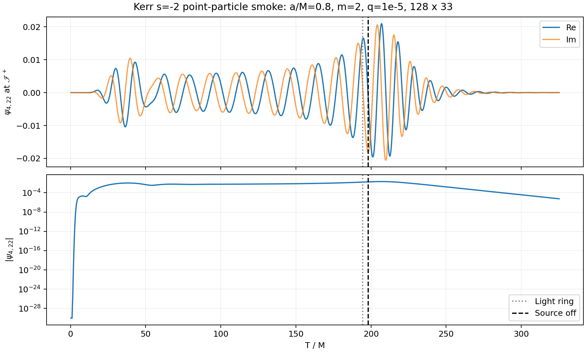

# s=-2 本地完整复现

使用固定上游提交的 smoke 配置和随仓库通量，演化 a/M=0.8、m=2、质量比 1e-5 的点粒子源。128×33 网格，七点空间有限差分、classical RK4。初始场为零，粒子源随时间开启。提取量为 R=0 的未来零无穷处自旋权重 -2 球谐系数 psi4_22。



- 演化终点：T/M=325.25；输出从 0.25 开始，间隔 0.25，共 1301 点。
- 光环事件：T/M=194.357657；视界穿越与源关闭：198.195862。
- 所有输出有限；峰值模长 0.02100147，末点模长 5.64333e-6。
- 求解器 58 项、共享工具 5 项、本地标量/坐标对齐 10 项测试通过。
- 142 个导入文件与上游逐文件 SHA-256 一致。

[复数数组](psi4_l2_m2.npz) · [CSV](waveform.csv) · [完整运行元数据](metadata.json) · [校验报告](verification.json)

复现到本地输出目录：

```bash
bash run_sminus2.sh outputs/sminus2_smoke --no-progress
.venv/bin/python src/report_sminus2.py outputs/sminus2_smoke docs/sminus2_smoke
```

上下两图分别是实部/虚部与模长；竖线表示相同 T 坐标下的轨迹事件，并非波形峰值。没有进行 QNM 频率拟合，也没有计算 strain。此结果是低分辨率功能复现，不构成连续极限收敛证明；A1 符号与归一化 bridge 仍沿用上游 `conditional-open` 标记。元数据保留本地路径用于来源追踪，重新运行时路径与缓存命中状态可以不同。
